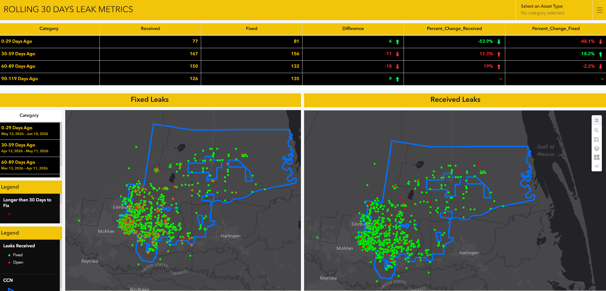

# Leak-Performance-Trend-Analysis-and-Operational-Monitoring-for-Water-Utilities
Developed a rolling performance monitoring dashboard to identify trends in leak activity, closure rates, and backlog growth through interactive spatial and temporal analysis.
## Executive Summary

Building upon an existing automated leak reporting framework, I developed an operational performance dashboard designed to monitor changes in leak response outcomes over time. Using a rolling 30-day methodology, the dashboard compared current performance against previous reporting periods to identify improving or deteriorating trends in leak operations.
The solution provided utility leadership with insight into fluctuations in leaks received, leaks resolved, and backlog growth while highlighting geographic areas where leak response times exceeded expected thresholds. Interactive filtering and spatial analysis transformed operational records into actionable intelligence that supported continuous performance monitoring and resource allocation.

---
## The dashboard provided an operational performance view of leak activity by comparing rolling 30-day reporting periods. Interactive visualizations highlighted changes in leaks received, leaks resolved, backlog growth, and areas experiencing prolonged repair durations to support proactive decision-making.

---

## Business Problem

Although utility staff had visibility into current leak conditions, leadership lacked a standardized method to evaluate whether operational performance was improving or declining over time. Traditional reporting focused on current workload but did not provide context regarding trends in incoming leaks, closure rates, or backlog accumulation.
A data-driven solution was needed to monitor changes in operational performance, identify emerging inefficiencies, and detect geographic patterns associated with prolonged response times. This would enable leadership to proactively address operational challenges before they resulted in significant backlogs or service impacts.

---

## Methodology

1.	Leveraged the existing Python ETL process and ArcGIS feature layer used to automate leak reporting.
2.	Calculated four rolling 30-day reporting periods to establish a comparative performance framework.
3.	Measured operational performance indicators for each reporting period, including:
o	Leaks Received
o	Leaks Fixed
o	Difference Between Leaks Received and Fixed
4.	Calculated percentage increases and decreases between reporting periods to identify trends in operational performance.
5.	Developed interactive dashboard elements allowing users to select specific reporting periods for detailed analysis.
6.	Configured map filtering so leak locations automatically updated based on selected time periods.
7.	Symbolized leak records based on status:
o	Open Leaks
o	Fixed Leaks
8.	Identified fixed leaks requiring more than 20 days to resolve and highlighted them using distinct map symbology.
9.	Evaluated spatial concentrations of prolonged response times to identify potential operational inefficiencies or resource constraints.

---

## Skills

ArcGIS
•	ArcGIS Online
•	ArcGIS Dashboards
•	Feature Services
•	Interactive Filtering
•	Operational Mapping
•	Spatial Pattern Analysis
Data Visualization
•	KPI Development
•	Rolling Period Analysis
•	Percentage Change Analysis
•	Trend Visualization
•	Interactive Dashboards
•	Performance Reporting
Analytical Techniques
•	Rolling Window Analysis
•	Performance Monitoring
•	Backlog Analysis
•	Comparative Trend Analysis
•	Spatial Cluster Identification
•	Operational Intelligence
Process Automation
•	Automated Data Refresh
•	Scheduled Reporting
•	Dashboard Synchronization
•	ETL Integration

---

## Results & Business Recommendations

The dashboard provided leadership with the ability to evaluate operational performance trends rather than relying solely on current workload metrics. Rolling 30-day comparisons revealed whether leak operations were improving, deteriorating, or remaining stable across multiple reporting periods.
Comparative indicators highlighted changes in incoming leaks, completed repairs, and net backlog growth. The interactive filtering capabilities allowed users to investigate the specific leak events contributing to changes in performance metrics.
Spatial analysis of fixed leaks requiring more than 20 days to resolve revealed opportunities to investigate whether prolonged response times were concentrated within particular geographic areas. Identifying these patterns enabled leadership to explore whether staffing limitations, asset conditions, recurring infrastructure issues, or operational processes contributed to extended repair durations.

